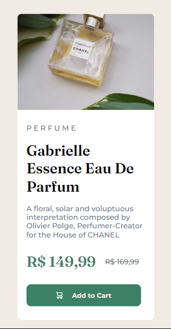

# Desafio Product Card - Frontend-Mentor

Este é um desafio de Product Card proposto pelo site Frontend-Mentor.

## Tabela de Conteúdos

- [Visão Geral](#visão-geral)
    - [Imagens](#imagens)
    - [Link da página](#link)
- [Processo](#processo)
    - [Linguagens utilizadas](#linguagens-utilizadas)
    - [O que aprendi](#o-que-aprendi)
    - [Possíveis evoluções](#possíveis-evoluções)
- [Autor](#autor)

## Visão-geral

### Imagens

<br>

````
Versão de Desktop
````

   

<br>

````
Versão Mobile
````

 

### Link

- Página no GitHub Pages: <a href="https://julio-mansan2.github.io/product-card/">Clique aqui!</a>

## Processo

### Linguagens utilizadas

<br>

- Marcações semânticas de HTML5
- Propriedades de customização do CSS3

<br>

### O que aprendi

<br>

- Modificar a escrita de caracteres com CSS 

````css

p {
    text-transform: uppercase;
}

````

<br>

- Alterar a forma do cursor durante o :hoover

````css

a:hover {
    cursor: pointer;
}

````
<br>

- Utilizar variáveis

````css

:root {
    --cream: hsl(30, 38%, 92%);
    --dark-cyan: hsl(158, 36%, 37%);
    --dark-grayish-blue: hsl(228, 12%, 48%);
    --very-dark-blue: hsl(212, 21%, 14%);
}

p {
    color: var(--cream)
}

````
<br>

### Possíveis evoluções

<br>

- Códigos mais compactos;
- Utilizar mais seletores;
- Criar um HTML mais semântico.

<br>

## Autor

GitHub - <a href="https://github.com/julio-mansan2">julio-mansan2</a> <br>
Front-end Mentor - <a href="https://www.frontendmentor.io/profile/julio-mansan2">julio-mansan2</a> <br>